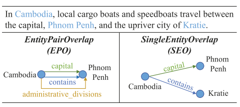

**Attention as Relation: Learning Supervised Multi-head Self-Attention for Relation Extraction**

**2020 IJCAI**

------

# 摘要

联合抽取依然面临着一些**挑战**

- 识别重叠的关系三元组
- 探测多类型的关系

这篇论文提出了一种基于注意力模型的联合抽取模型，主要包含了实体抽取模块和关系探测模块

模型的**关键**在于 提出的模型在关系探测模块使用了一种监督多头自适应机制，用来学习每种关系类型的字符级别的关系

# 引言

关系抽取传统的方法是将任务分为实体识别和关系分类两个独立的子任务，使用一种pipeline的方式将他们进行串联

- 缺点：导致了错误的传播
- 忽略了两个子任务之间的联系

为了避免错误传播，一些研究开始着手于将实体和他们的语义关系以一种联合抽取的方式进行处理

尽管已经取得了一些成就，这一任务中复杂的关系模型依然带来了很多**挑战**

- 识别重叠的关系三元组

  

- 应该考虑不同的关系类型下实体的语义特征

  如上图，当模型预测到“包含”这一关系的时候，也应该捕捉到“位置”这一语义，而在对上述实体对的“首都”关系进行预测时，需要学习“行政职能”这一语义

- 准确地识别一个*EntityPairOverlap*三元组多种可能出现的关系类型

  如上图，*(Cambodia, Phnom Penh)*之间有三种关系，足以说明二者的关系密切，但是 <u>在多类分类器中，所有可能的关系类型共享相同的概率空间，这使得它们在一定程度上具有互斥性</u>

虽然[post-processing](https://www.aclweb.org/anthology/P19-1136.pdf)能够用来获取*EntityPairOverlap*三元组，

[*论文解读：GraphRel： Modeling text as relational graphs for joint entity and relation extraction*](https://wangbing1416.github.io/paper_reader/paper_reader2/paper2.html)

------

[1]    T.-J. Fu, P.-H. Li, and W.-Y. Ma, “GraphRel: Modeling Text as Relational Graphs for Joint Entity and Relation Extraction,” in *Proceedings of the 57th Annual Meeting of the Association for Computational Linguistics*, 2019, pp. 1409–1418, doi: 10.18653/v1/P19-1136.

[2]    J. Liu, S. Chen, B. Wang, J. Zhang, N. Li, and T. Xu, “Attention as Relation: Learning Supervised Multi-head Self-Attention for Relation Extraction,” in *Proceedings of the Twenty-Ninth International Joint Conference on Artificial Intelligence*, Jul. 2020, pp. 3787–3793, doi: 10.24963/ijcai.2020/524.